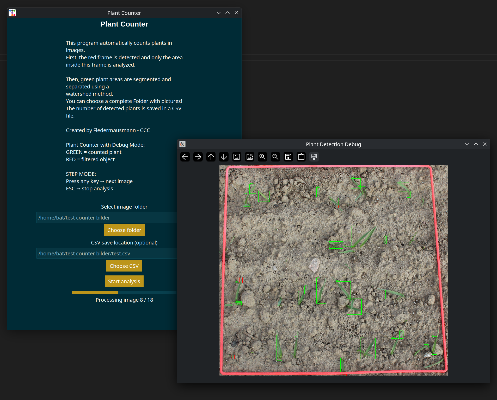

# Plant Counter

### Background
At the JKI we need to know how many plants are grown at the experimental field.
Count every picture bei hand can take hours ...
To make life more easy i creae this Program.

## Main Funktion
This program automatically counts plants in images.
First, the red frame is detected and only the area
inside this frame is analyzed. 

Then, green plant areas are segmented and separated using a 
watershed method.
You can choose a complete Folder with pictures!
The number of detected plants is saved in a CSV file.

Created by Fledermausmann - from CCC


>[!IMPORTANT]
>Use the Debug windows to sort out the wrong Pictures from the list to manualy count

>[!TIP]
> Because the Plants can have diffrent grow situations(like 60% one leaf / 30% two leaf / 10% leaf) in 
> every plot, i use a linear Regression for the Reasons.
>
> You need enought manual count pitures vs the atomatic count pictures to do this ...


## Features
- Read Folderwith all Pic (.jpg, .jpeg, .png)
- Count Green Plants in the Picture
- Save the Count as CSV




>[!NOTE]
>This Programm is tested on Linux


## Installation

```bash
git clone https://github.com/Fledermausmann-C3D2/Plant_Counter.git
cd Plant_Counter
python3 -m venv venv
source venv/bin/activate
pip install -r requirements.txt
